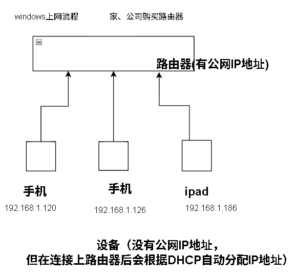
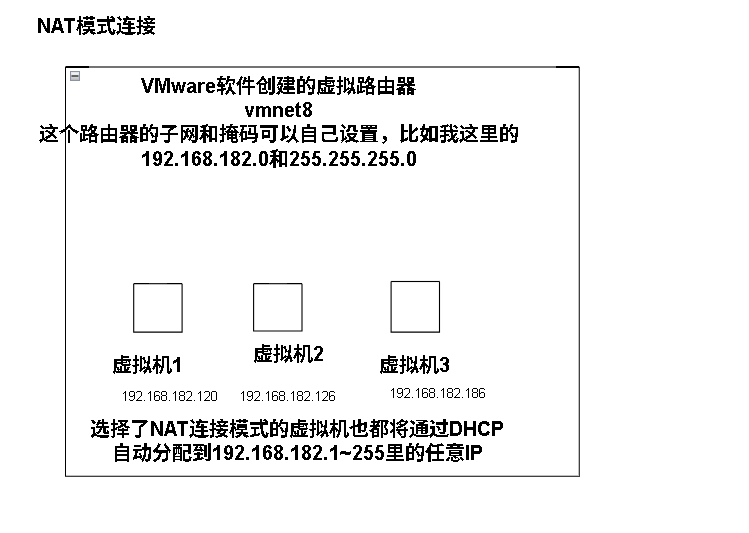
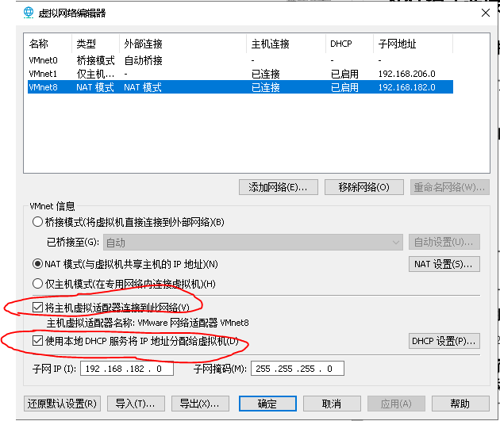
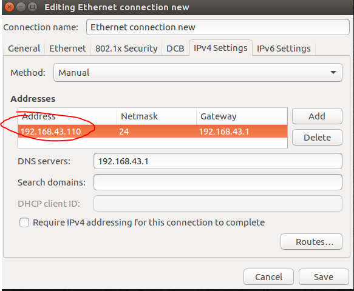
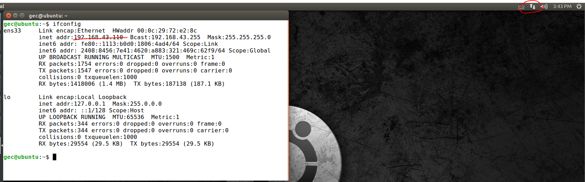

### 常见的Window计算机上网流程




### IP 分配方式​​
路由器为内网设备分配 IP 的方式有两种：

​**​动态分配（DHCP）​​：**
路由器自动分配 IP（如 192.168.1.100~192.168.1.200），设备连接时随机获取，断开后 IP 可能被回收重用。
​​优点​​：简单方便，适合大多数家庭网络。

​**​手动设置（静态 IP）​​：**
这部分一般位于192.168.1.0~192.168.1.100 地址段，需要手动指定。
在设备或路由器上手动指定固定 IP（如 192.168.1.5）。
​​适用场景​​：需要长期稳定 IP 的设备（如打印机、NAS 服务器）。

**​例外情况：设备直接拥有公网 IP​​**
以下情况设备可能直接使用公网 IP：

* ​​IPv6 网络​​：IPv6 地址充足，理论上可为每个设备分配公网 IP。
* ​​企业专线​​：企业可能购买多个公网 IP，直接分配给服务器等设备。
* DMZ 或端口转发​​：通过路由器设置，将公网 IP 的特定端口映射到内网设备（如将公网 IP 的 80 端口指向 NAS 的 HTTP 服务）。

验证您的网络环境​​
​​查看路由器公网 IP​​：访问 ip.sb 或路由器管理界面。

​​查看设备私有 IP​​：
Windows：命令提示符输入 ipconfig
macOS/Linux：终端输入 ifconfig 或 ip a

总结
路由器作为内外网的桥梁，通过公网 IP 和 NAT 技术，让多个设备共享一个公网 IP 访问互联网。内网设备使用私有 IP 并通过 DHCP 或手动设置完成联网，既节省了地址资源，又提升了网络安全性。

### 网关
路由器和手机热点，他们的网关一般都是固定的
路由器|安卓手机|苹果手机
-|-|-
**192.168.1.1**|**192.168.43.1**|**172.20.10.1**

其中连接到手机热点的设备DHCP分配到的IP地址范围是192.168.43.1~192.168.43.255。地址范围要比路由器的网关地址范围大（192.168.1.100~192.168.1.200），但实际可以供连接的上网设备数量最多支持5-10台，路由器支持连接更多的设备


### 私有IP地址的数量计算
通过 ​​网关（Gateway）​​ 和 ​​子网掩码（Subnet Mask）​​ 可以计算出子网内的 ​​可用私有IP地址总数​​。以下是详细步骤和示例：

一、基本概念
​​网关​​：通常是子网的第一个或最后一个可用IP（例如 192.168.1.1）。
​​子网掩码​​：决定IP地址的 ​​网络部分​​ 和 ​​主机部分​​（如 255.255.255.0 对应CIDR /24）。
​​私有IP范围​​：
10.0.0.0 ~ 10.255.255.255（CIDR /8）
172.16.0.0 ~ 172.31.255.255（CIDR /12）
192.168.0.0 ~ 192.168.255.255（CIDR /16）
二、计算步骤
1. ​​确定子网掩码的CIDR格式​​
子网掩码转换为二进制后，连续1的数量即为CIDR值：

255.255.255.0 → 11111111.11111111.11111111.00000000 → ​​/24​​
2. ​​计算主机位数（Host Bits）​​
总位数（IPv4为32位） - CIDR值 = 主机位数。
示例（/24）：32 - 24 = 8 位主机位。
3. ​​计算可用IP总数​​
公式：可用IP数 = 2^主机位数 - 2
​​减2​​ 是为了排除 ​​网络地址​​（全0）和 ​​广播地址​​（全1）。
示例（/24）：2^8 - 2 = 256 - 2 = 254 个可用IP。
4. ​​结合网关确定具体范围​​
网关通常是子网的第一个或最后一个可用IP。
示例：
​​网关​​：192.168.1.1
​​子网掩码​​：255.255.255.0（CIDR /24）
​​网络地址​​：192.168.1.0（子网起始）
​​广播地址​​：192.168.1.255（子网结束）
​​可用IP范围​​：192.168.1.1 ~ 192.168.1.254（共254个IP）
三、具体案例
案例1：家庭路由器（192.168.1.1/24）
​​子网掩码​​：255.255.255.0 → ​​/24​​
​​主机位数​​：32 - 24 = 8
​​可用IP总数​​：2^8 - 2 = 254
​​可用IP范围​​：192.168.1.1 ~ 192.168.1.254
案例2：企业网络（10.0.0.1/16）
​​子网掩码​​：255.255.0.0 → ​​/16​​
​​主机位数​​：32 - 16 = 16
​​可用IP总数​​：2^16 - 2 = 65,534
​​可用IP范围​​：10.0.0.1 ~ 10.0.255.254
案例3：手机热点（192.168.43.1/24）
​​子网掩码​​：255.255.255.0 → ​​/24​​
​​可用IP总数​​：254
​​可用IP范围​​：192.168.43.1 ~ 192.168.43.254


### NAT模式连接


NAT（网络地址转换）​​：路由器通过 NAT 技术，将内网设备的私有 IP 和端口号，映射到自己的公网 IP 和端口。例如：
当您的手机（192.168.1.2）访问网站时，路由器会将请求源 IP 改为公网 IP，并记录映射关系。
网站返回数据到路由器的公网 IP，路由器再根据映射表转发给手机。

同样的，VMware也用这个NAT连接技术，就相当于你在电脑里启动了一个虚拟的路由器





两项都是要进行勾选的：
1.将主机虚拟适配器连接到此网络：
先前说过，NAT模式下等于是Vmware创建了一个虚拟路由器，再对虚拟机进行子网下的IP地址分配，这一项是将主机也连接到这个子网下，这样我们虚拟机就可以和宿主机进行通信了（重要）

2.使用本地DHCP服务分配IP地址给虚拟机
勾选了之后，使用NAT模式下的虚拟机连接网络会自动分配IP地址，否则要手动写静态的IP


### 桥接模式连接
桥接模式，类似于将宿主机连接网络的方式按原样复制到虚拟机中，此时虚拟机的地位和宿主机是同级的，他们都是位于路由器子网下的同一网段的不同IP，所以虚拟机和主机之间可以相互通信

首先查看宿主机的IP地址
```
ipconfig /all
```

我这里连接的是无线网手机热点
```
无线局域网适配器 WLAN:

   连接特定的 DNS 后缀 . . . . . . . :
   描述. . . . . . . . . . . . . . . : Realtek 8821CE Wireless LAN 802.11ac PCI-E NIC
   物理地址. . . . . . . . . . . . . : 70-66-55-9C-2E-35
   DHCP 已启用 . . . . . . . . . . . : 是
   自动配置已启用. . . . . . . . . . : 是
   IPv6 地址 . . . . . . . . . . . . : 2408:8456:7e41:4620:3cc9:e526:624f:2ada(首选)
   临时 IPv6 地址. . . . . . . . . . : 2408:8456:7e41:4620:9a5:54c3:e66a:6daf(首选)
   本地链接 IPv6 地址. . . . . . . . : fe80::4244:18af:79b7:d374%12(首选)
   IPv4 地址 . . . . . . . . . . . . : 192.168.43.120(首选)
   子网掩码  . . . . . . . . . . . . : 255.255.255.0
   获得租约的时间  . . . . . . . . . : 2025年4月24日 9:20:20
   租约过期的时间  . . . . . . . . . : 2025年4月24日 15:52:48
   默认网关. . . . . . . . . . . . . : fe80::b094:85ff:fe08:26fc%12
                                       192.168.43.1
   DHCP 服务器 . . . . . . . . . . . : 192.168.43.1
   DHCPv6 IAID . . . . . . . . . . . : 158361173
   DHCPv6 客户端 DUID  . . . . . . . : 00-01-00-01-26-DB-84-76-00-E0-4C-87-A4-F1
   DNS 服务器  . . . . . . . . . . . : 192.168.43.1
   TCPIP 上的 NetBIOS  . . . . . . . : 已启用
```

这里如果是手动分配静态IP的话，要注意这里的虚拟机要求IP地址是和主机在同一网段，因此主机192.168.43.120，虚拟机可以填写为192.168.43.x。（最后一位不一样就行），我写的是192.168.43.110

其他的都和主机一样即可

并且dns和网关是一样的。这是因为：
您的情况完全正常！当您通过手机热点上网时，手机会同时充当 ​​网关​​ 和 ​​DNS 转发器​​，因此 默认网关 和 DNS 服务器 的 IP 地址都是手机热点在内网的 IP（192.168.43.1）。以下是详细解释：

​​手机热点的双重角色​​
​​网关（NAT 设备）​​：
手机将您的设备（如电脑）接入移动网络，并通过 ​​网络地址转换（NAT）​​ 将内网流量（192.168.43.x）转换为公网 IP。
​​DNS 转发器​​：
手机内置 DNS 服务，负责将您的 DNS 查询请求转发给移动运营商（如中国移动/联通/电信）的 DNS 服务器，或直接使用公共 DNS（如 8.8.8.8）。

最后一步：Vmware虚拟网络编辑器中vmnet0，桥接至不要选择自动。选择你主机的网卡。这里我是用的无线网我就选了无限网卡

应用保存

终端输入
```
ifconfig
```
显示了设置的静态IP，且右上角显示联网成功
