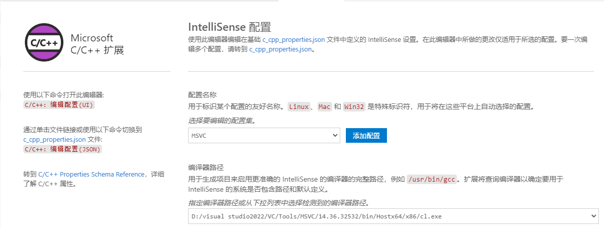

Vscode只是一款文本编辑器，虽然衍生功能强大，但是需要对其做环境配置


下载c/c++插件和c/c++ compile run插件
此时编写好了代码，仍然需要配置

主要配置三个json文件
c_cpp_properties.json
c/c++配置用文件，比如头文件路径，全局定义等
launch.json
调试配置，按F5启动调试时，从该配置文件读取设置和相关配置
tasks.json
调试配置，对应launch.json文件中的preLaunchTask项
settings.json
工程设置，编译设置等

### 各json文件的作用
首先，确保你已经将OpenCV的静态库文件添加到你的项目目录中，并记下这些文件的路径。

然后，在你的VSCode项目中，创建一个"tasks.json"文件，用于定义编译任务。在这个文件中，你需要指定编译器命令，包括OpenCV的包含路径和链接库路径。

接下来，你需要创建一个"launch.json"文件，用于配置调试器。在这个文件中，你需要指定可执行文件的路径。

最后，你需要在你的源代码中包含OpenCV的头文件，并链接OpenCV的静态库。

详细的设置步骤取决于你的具体项目结构和编译环境，但通常情况下，以上提到的几个步骤是连接OpenCV静态库到VSCode项目所需的基本步骤。


**一、一般的c++工程：**

1.c_cpp_properties.json
```
{
    "configurations": [
        {
            "name": "Win32",                         //没影响的设置
            "includePath": [
                "${workspaceFolder}/**"           //包含目录只包括了工作区，两个**代表需要递归查找子目录
            ],
            "defines": [
                "_DEBUG",
                "UNICODE",
                "_UNICODE"
            ],
            "compilerPath": "C:/Program Files/mingw64/bin/g++.exe", //编译器的路径，编译c语言选gcc，
                                                                    //c++选g++
            "cStandard": "c17",                              //C语言标准
            "cppStandard": "gnu++14",                    //c+标准
            "intelliSenseMode": "windows-gcc-x64"
        }
    ],
    "version": 4
}
```
2.launch.json
```
{
    // 使用 IntelliSense 了解相关属性。 
    // 悬停以查看现有属性的描述。
    // 欲了解更多信息，请访问: https://go.microsoft.com/fwlink/?linkid=830387
    "version": "0.2.0",
    "configurations": [
        {
            "name": "gcc.exe - 生成和调试活动文件",
            "type": "cppdbg",
            "request": "launch",
            "program": "${workspaceFolder}/exe/${fileBasenameNoExtension}.exe",//同task.json中的
            "args": [],
            "stopAtEntry": false,
            "cwd": "${workspaceFolder}",
            "environment": [],
            "externalConsole": true,//如果你要输入，则设置为true，这个设置用于调出控制台终端
            "MIMode": "gdb",
            "miDebuggerPath": "C:\\Program Files\\mingw64\\bin\\gdb.exe",//调试器路径,要改成自己的
            "setupCommands": [
                {
                    "description": "为 gdb 启用整齐打印",
                    "text": "-enable-pretty-printing",
                    "ignoreFailures": true
                }
            ],
            "preLaunchTask": "C/C++: gcc.exe 生成活动文件"     //这里的名字需要和task.json的label一致因为我们希望是启动编译得到的可执行文件
        }
    ]
}
```
3.task.json
```
{
    "version": "2.0.0",
    "tasks": [
        {
            "type": "cppbuild",
            "label": "C/C++: gcc.exe 生成活动文件",
            "command": "C:\\Program Files\\mingw64\\bin\\g++.exe",//要改成你自己的gcc.exe地址
            "args": [
                "-g",
                "${file}",
                "-o",
                "${workspaceFolder}/exe/${fileBasenameNoExtension}.exe"//把生成的.exe文件放到exe文件夹中
            ],
            "options": {
                "cwd": "${workspaceFolder}"
            },
            "problemMatcher": [
                "$gcc"
            ],
            "group": {
                "kind": "build",
                "isDefault": true
            },
            "detail": "调试器生成的任务。"
        }
    ]
}
```


**2.连接第三方库Opencv环境配置**

**2.1 Msvc（微软）编译器**
由于mingw编译器需要posix型和非posix型进行区分，而且下载的微软已编译win版本的Opencv没有给到mingw编译器的接口，踩坑太多暂时先采用了msvc版本的编译器


(1)打开visual studio本地的64位cmd，启动code
其实本质上还是因为没有配置环境变量，因为如果不这样启动opencv会识别不到微软编译器等环境


由于已经下载过扩展了，可以在右下方选择任务的配置


实质上在弹出的任务配置界面选择ui界面可以看到

由于我们是在vs的cmd下启动的vscode，所以可以识别到msvc编译器的选项和路径
之前不是这种启动方式的务必要从

```
C:\ProgramData\Microsoft\Windows\Start Menu\Programs\Visual Studio 2022\Visual Studio Tools\VC
```
目录下启动
```
x64 Native Tools Command Prompt for VS 2022
```


(2)配置三个json文件

**1.c_cpp_properties.json**
```
{
    "configurations": [
        {
            "name": "Win32",
            "includePath": [
                "${workspaceFolder}/**",
                "E:/opencv/opencv-4.5.4_compile/install/include/"
            ],
            "defines": [
                "_DEBUG",
                "UNICODE",
                "_UNICODE"
            ],
            "compilerPath": "C:/Program Files/mingw64_1/bin/g++.exe",
            "cStandard": "c17",
            "cppStandard": "gnu++14",
            "intelliSenseMode": "windows-gcc-x64"
        },
        {
            "name": "MSVC",
            "includePath": [
                "D:/visual studio2022/VC/Tools/MSVC/14.36.32532/include",
                "E:/opencv/opencv/build/include/**"
            ],
            "defines": [
                "_DEBUG",
                "UNICODE",
                "_UNICODE"
            ],
            "compilerPath": "D:/visual studio2022/VC/Tools/MSVC/14.36.32532/bin/Hostx64/x86/cl.exe",
            "cStandard": "c11",
            "cppStandard": "gnu++14",
            "intelliSenseMode": "windows-msvc-x64",
            "mergeConfigurations": false,
            "browse": {
                "path": [
                    "c:/Users/64574/Desktop/repO/opencv/**",
                    "${workspaceFolder}"
                ],
                "limitSymbolsToIncludedHeaders": true
            }
        }
    ],
    "version": 4
}
```
**2.launch.json**
```
{
    // 使用 IntelliSense 了解相关属性。 
    // 悬停以查看现有属性的描述。
    // 欲了解更多信息，请访问: https://go.microsoft.com/fwlink/?linkid=830387
    "version": "0.2.0",
    "configurations": [
        {
            "name": "(Windows msvc opencv) 启动",
            "type": "cppvsdbg",
            "request": "launch",
            "program": "${fileDirname}\\${fileBasenameNoExtension}.exe",
            "args": [],
            "stopAtEntry": false,
            "cwd": "${fileDirname}",
            "environment": [],
            "console": "externalTerminal",
            "preLaunchTask":"C/C++: cl.exe 生成活动文件 opencv"
        },
    
        {
            "name": "gcc.exe - 生成和调试活动文件",
            "type": "cppdbg",
            "request": "launch",
            "program": "${workspaceFolder}/exe/${fileBasenameNoExtension}.exe",//同task.json中的
            "args": [],
            "stopAtEntry": false,
            "cwd": "${workspaceFolder}",
            "environment": [],
            "externalConsole": true,//如果你要输入，则设置为true
            "MIMode": "gdb",
            "miDebuggerPath": "C:\\Program Files\\mingw64_1\\bin\\gdb.exe",//要改自己的路径
            "setupCommands": [
                {
                    "description": "为 gdb 启用整齐打印",
                    "text": "-enable-pretty-printing",
                    "ignoreFailures": true
                }
            ],
            "preLaunchTask": "C/C++: g++.exe 生成活动文件 opencv"
        }
    ]
}
```
**3.task.json**
```
{
    "version": "2.0.0",
    "tasks": [
        {
            "type": "cppbuild",
            "label": "C/C++: g++.exe 生成活动文件 opencv",
            "command": "C:\\Program Files\\mingw64\\bin\\g++.exe",
            "args": [
                "-g",
                "${file}",
                "-o",
                "${workspaceFolder}/exe/${fileBasenameNoExtension}.exe",
                "-L",
                "E:/opencv/opencv-4.5.4_compile/install/x64/mingw/lib",
                "-l",
                "opencv_highgui454",
                "-I",
                "E:/opencv/opencv-4.5.4_compile/install/include"
            ],
            "options": {
                "cwd": "${workspaceFolder}"
            },
            "problemMatcher": [
                "$gcc"
            ],
            "group": {
                "kind": "build",
                "isDefault": true
            },
            "detail": "调试器生成的任务。"
        },
        {
            "type": "cppbuild",
            "label": "C/C++: cl.exe 生成活动文件 opencv",
            "command": "cl.exe",
            "args": [
                "/Zi",
                "/EHsc",
                "/nologo",
                "/Fe${fileDirname}\\${fileBasenameNoExtension}.exe",
                "${file}",
                "/I\"E:\\opencv\\opencv\\build\\include\"",
                "E:\\opencv\\opencv\\build\\x64\\vc15\\lib\\opencv_world454.lib"
            ],
            "options": {
                "cwd": "${fileDirname}"
            },
            "problemMatcher": [
                "$msCompile"
            ],
            "group": "build",
            "detail": "编译器: cl.exe"
        }
    ]
}
```

调试运行要记得是在左侧栏进行任务配置的选取后再调试

