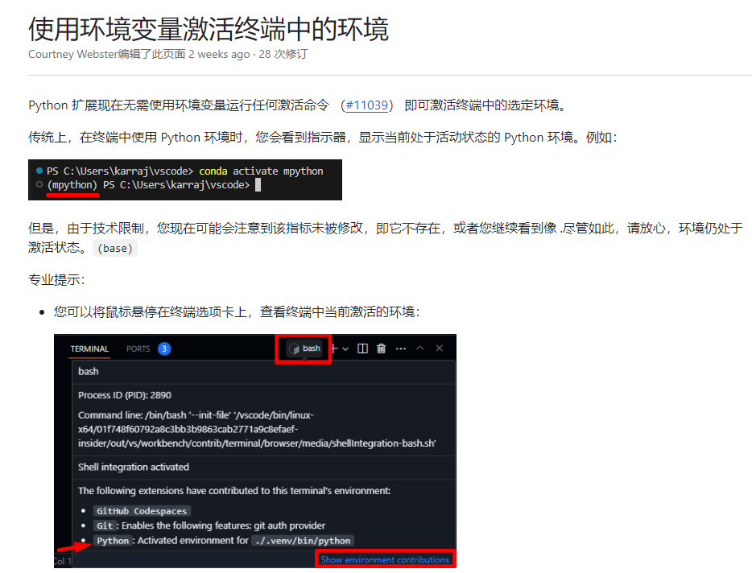

##Vscode

ctrl+shift+P  打开配置python 解释器

随后在conda环境中选择已经配置过的yolov5虚拟环境

在官方文档中，提示我们已经自动激活了之前选中的虚拟环境

##Pycharm

选择添加已有解释器，选择miniconda/envs/yolov5/python.exe
此时环境仍然不能激活，因为终端shell路径为powershell,网上查到似乎powershell激活虚拟环境需要管理员身份

接着在设置里将shell路径从powershell换成cmd，重启ide，环境成功激活了

