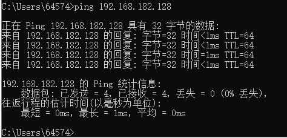

### 新建虚拟机


创建新的虚拟机>>自定义>>硬件兼容性（默认）>>稍后安装系统>>客户机操作系统（Linux）>>自定义虚拟机名称以及地址>>选择处理器数量与内核数量（2*2）>>虚拟内存（4G）>>网络选择NAT>>IO控制器LSI logic>>虚拟磁盘类型SCSI>>创建新的虚拟磁盘>>最大磁盘大小20G

进入系统后按照指引安装，安装完成后不要立刻启动虚拟机，要先到虚拟机设置中修改启动方式为自动选择而不是从ISO镜像文件启动


### 虚拟机的快照机制

类似于与保存了一个状态副本，可以随时进行回溯快照时的状态，推荐在环境都已经配置完成后进行快照

### SSH远程登录
要注意先前虚拟机设置选择网络为NAT模式。

命令ip addrr show显示IP地址
随后在宿主机上用PING命令PING虚拟机IP，看是否能PING成功


#### 虚拟机安装OpenSSH服务
​​安装SSH服务​​
Ubuntu默认未安装SSH服务器，执行以下命令安装：
```
sudo apt update
sudo apt install openssh-server
```
​​启动SSH服务​​
确保服务已运行：
```
sudo systemctl start ssh
sudo systemctl enable ssh  # 设置开机自启
```
​​检查服务状态​​
```
sudo systemctl status ssh
```
如果显示 active (running) 表示服务已启动。

#### 检查网络模式
​​
你的情况属于 ​​NAT模式下，VMware通过虚拟网卡（VMnet8）打通了宿主机和虚拟机的直连通道​​，即使两者不在同一物理网段。以下是关键点：

​​1. 为什么宿主机和虚拟机IP不在同一网段却能访问？​​
​​宿主机有两个IP​​：
​​物理网卡IP​​：192.168.43.120（连接的是你的真实物理网络，如WiFi或以太网）。
​​虚拟网卡IP​​（VMnet8）：默认是 192.168.182.1（或其他类似地址，取决于VMware的NAT子网配置）。
​​虚拟机IP​​：192.168.182.128（属于VMware虚拟的NAT子网，和宿主机的虚拟网卡 VMnet8 在同一网段）。
虽然你的物理网络是 192.168.43.x，但​​宿主机通过虚拟网卡 VMnet8（IP 192.168.182.1）和虚拟机通信​​，与物理网络无关。因此，​​宿主机和虚拟机在虚拟网络中是同一网段​​。

​​2. 关键配置的作用​​
你提到的 ​​“将主机虚拟适配器连接到此网络” 已勾选​​，这表示：

VMware在宿主机上创建了一个虚拟网卡（如 VMnet8），并分配了IP（如 192.168.182.1）。
宿主机通过这个虚拟网卡直接连接到虚拟机的NAT网络，​​无需通过物理网络​​，因此：
宿主机可以直接访问虚拟机的IP（192.168.182.128）。
​​无需配置端口转发​​，因为两者在虚拟网络中已经是直连的。
​​3. 验证你的实际连接路径​​
​​在宿主机上执行 ipconfig（Windows）或 ifconfig（Linux/macOS）​​：
找到 VMnet8 的IP地址（例如 192.168.182.1）。
这个IP和虚拟机IP（192.168.182.128）在同一网段。
​​检查SSH连接的实际路径​​：
当你在宿主机用 192.168.182.128 连接虚拟机时，数据流是：
宿主机（VMnet8虚拟网卡：192.168.182.1） → 虚拟机（192.168.182.128）
​​完全在虚拟网络内部完成​​，不经过物理网络。
​​4. 为什么能直接访问？​​
​​NAT模式的隐藏规则​​：当勾选“将主机虚拟适配器连接到此网络”时，VMware默认允许宿主机通过虚拟网卡直接访问虚拟机。
​​类似局域网​​：宿主机和虚拟机在虚拟网络中组成一个“小型局域网”，即使物理网络不同，也不影响它们之间的通信。
​​总结​​
​​属于NAT模式​​：你的虚拟机确实在NAT模式下，但通过虚拟网卡 VMnet8 实现了宿主机和虚拟机的直连。
​​无需端口转发​​：因为宿主机和虚拟机在虚拟网络中已经是“同一局域网”的成员，可以直接通过虚拟IP（192.168.182.x）通信。
​​物理网段不同无关​​：物理网络的 192.168.43.x 和虚拟网络的 192.168.182.x 是独立的，互不影响。
因此，你的配置是合法的，且符合VMware的NAT模式默认行为（当虚拟网卡绑定到宿主机时）。如果未来取消勾选“将主机虚拟适配器连接到此网络”，才需要端口转发。

总结：

桥接模式:宿主机和虚拟机分别拥有同一网段下的不同IP，这个时候的虚拟机可以被外部通过这个分配到的IP地址访问到，但是缺点是会占用同一个局域网下的ip地址。
NAT模式：设置了另一个虚拟的IP地址，相当于宿主机和虚拟机内部再形成了一个虚拟局域网，只有宿主机能通过这个分配的虚拟地址访问虚拟机，或者需要端口转发才能让外部访问到虚拟机IP


#### putty远程登录
打开puttu 输入虚拟机IP地址，端口选择22 协议为选择SSH，输入用户名密码
chen
20010624chen


### 安装vmtools


​​vmtools​​（通常指 ​​VMware Tools​​）是 VMware 公司为其虚拟化平台（如 VMware Workstation、VMware Fusion、VMware ESXi 等）提供的一套实用工具集，安装在虚拟机（客户机操作系统）中，用于优化虚拟机的性能、改善用户体验，并增强虚拟机与宿主机（物理主机）之间的交互功能。

​​VMware Tools 的主要功能​​
​1.​增强的图形性能​​
支持更高的屏幕分辨率和刷新率。
启用 3D 图形加速（适用于支持的游戏或图形应用）。
​2.​无缝鼠标集成​​
允许鼠标在宿主机和虚拟机之间自由移动，无需手动切换（如按 Ctrl+Alt）。
​3.​剪贴板共享​​
在宿主机和虚拟机之间共享剪贴板内容，方便复制粘贴文本或文件。
​4.​文件拖放共享​​
支持通过拖放操作在宿主机和虚拟机之间传输文件。
​5.​时间同步​​
自动同步虚拟机与宿主机的时间，避免时间偏差问题。
​6.​虚拟硬件优化​​
优化虚拟硬盘、内存和网络适配器的性能。
支持动态调整虚拟硬件（如调整虚拟磁盘大小）。
​7.​快照和备份支持​​
确保在创建虚拟机快照或备份时，客户机文件系统处于一致状态。
​8.​网络性能提升​​
提供更高效的虚拟网卡驱动，提升网络传输速度。
​9.​客户机操作系统信息报告​​
向宿主机报告虚拟机的操作系统版本、IP 地址等信息，便于管理。
```
sudo apt-get autoremove open-vm-tools
sudo apt-get install open-vm-tools
sudo apt-get install open-vm-tools-desktop
```
终端输入命令行然后重启虚拟机

### 安装gcc/g++相关编译工具链
```
sudo apt update
# 安装 GCC 和基础开发工具（包含 make、g++ 等）
sudo apt install build-essential -y

# 验证安装
gcc --version
```

### code安装

没什么好讲的

傻瓜式

### 配置梯子

虚拟机是amd64架构的

打开操作系统的 应用终端 ，输入下面的命令进行安装：
```
sudo dpkg -i Clash.Verge_2.0.3_amd64.deb
```
Ubuntu 24.04 版本无法正常安装
如果遇到缺少依赖的错误，需要额外下载 libwebkit2gtk 和 libjavascriptcoregtk 依赖：


输入下面的命令进行安装：

```
sudo apt install ./libwebkit2gtk-4.0-37_2.43.3-1_amd64.deb
sudo apt install ./libjavascriptcoregtk-4.0-18_2.43.3-1_amd64.deb
```

以上都是采取本地安装的方式，日后如果需要安装特定版本的包这是一个通用过程
期间可能遇到需要修复依赖的情况：
```

chen@chen-vm:~/Clash-verge$ sudo apt install ./libwebkit2gtk-4.0-37_2.43.3-1_amd64.deb
sudo apt install ./libjavascriptcoregtk-4.0-18_2.43.3-1_amd64.deb
Reading package lists... Done
Building dependency tree... Done
Reading state information... Done
You might want to run 'apt --fix-broken install' to correct these.
The following packages have unmet dependencies:
 clash-verge : Depends: libwebkit2gtk-4.1-0 but it is not installed

E: Unmet dependencies. Try 'apt --fix-broken install' with no packages (or specify a solution).

Reading package lists... Done
Building dependency tree... Done
Reading state information... Done
You might want to run 'apt --fix-broken install' to correct these.
The following packages have unmet dependencies:
 clash-verge : Depends: libwebkit2gtk-4.1-0 but it is not installed

E: Unmet dependencies. Try 'apt --fix-broken install' with no packages (or specify a solution).
```
这个时候要使用
```
sudo apt --fix-broken install
```
修复相关依赖

现在还没完成，不知道为什么ubuntu的应用启动有点怪 安装后的软件会一片白，亦或者无法进行操作
后面重启了虚拟机发现解决了，而且是再次启动需要授权密码，猜测可能是权限问题

